# Passo a Passo da Instalação do Windows Server 2022 no VirtualBox

## Início

Entre no site da Microsoft e procure pela ISO do windows Server 2022.

Tenha o VirtualBox instalado em seu computador.

## Criação da Máquina Virtual

Abra o VirtualBox e clique em Novo.

Defina um Nome (ex: Windows Server 2022).

Escolha o local onde o arquivo da máquina virtual será salvo (C:\Users\...\VirtualBox...)

Em Imagem ISO, selecione o arquivo baixado (procure a ISO do Windows Server 2022)

Escolha Tipo: Microsoft Windows e Versão: Windows 2022 (64-bit).

Ignorar esta etapa

Defina a Memória RAM (recomenda-se pelo menos 2 GB ou 4 GB) e o número de CPUs (2 núcleos).

Escolha Criar um novo disco rígido virtual e defina o tamanho (USEI UM DISCO DE 100 GB). Clique em finalizar.

## Instalação do Sistema

Clique em Iniciar para ligar a máquina virtual.

Pressione qualquer tecla quando aparecer a mensagem para dar o boot pela ISO.

Escolha o Idioma, o Formato de hora e o Teclado, e clique em Avançar.

Clique em Instalar agora.

Escolha a versão desejada: selecione Windows Server 2022 Standard (Experiência Desktop) caso queira a interface gráfica (tela normal com mouse).

Aceite os termos de licença e clique em Avançar.

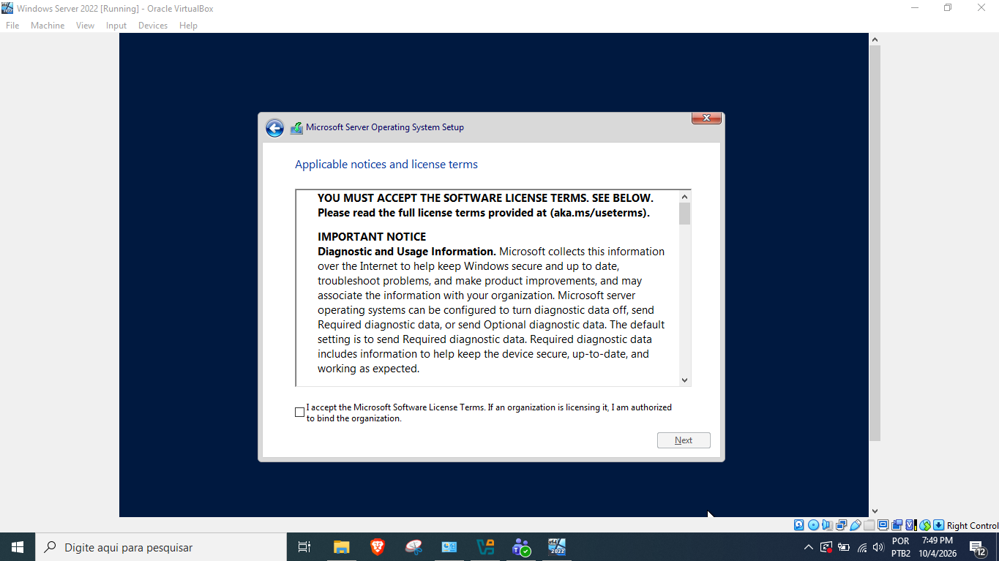

Selecione Personalizada: instalar apenas o Windows (avançado).

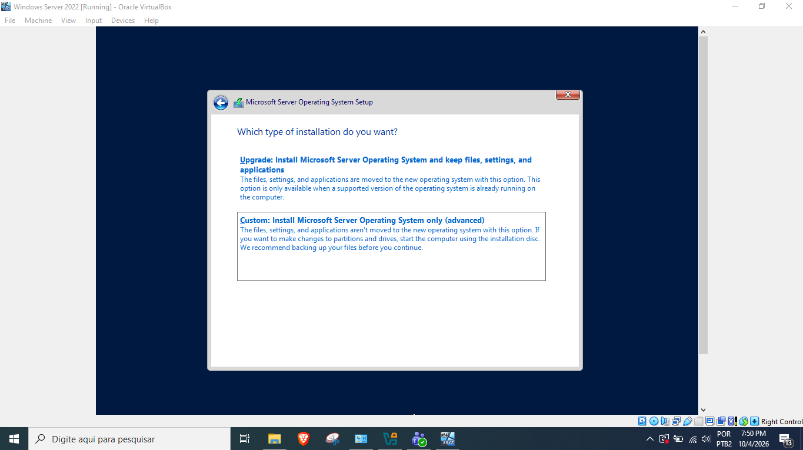

Escolha o disco virtual criado e clique em Avançar. A instalação dos arquivos vai começar.

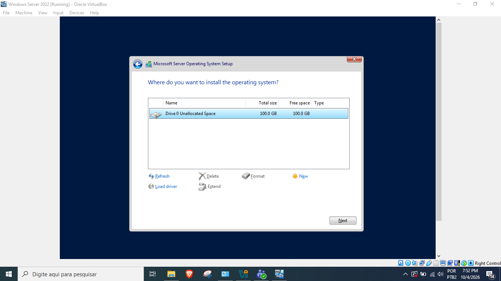

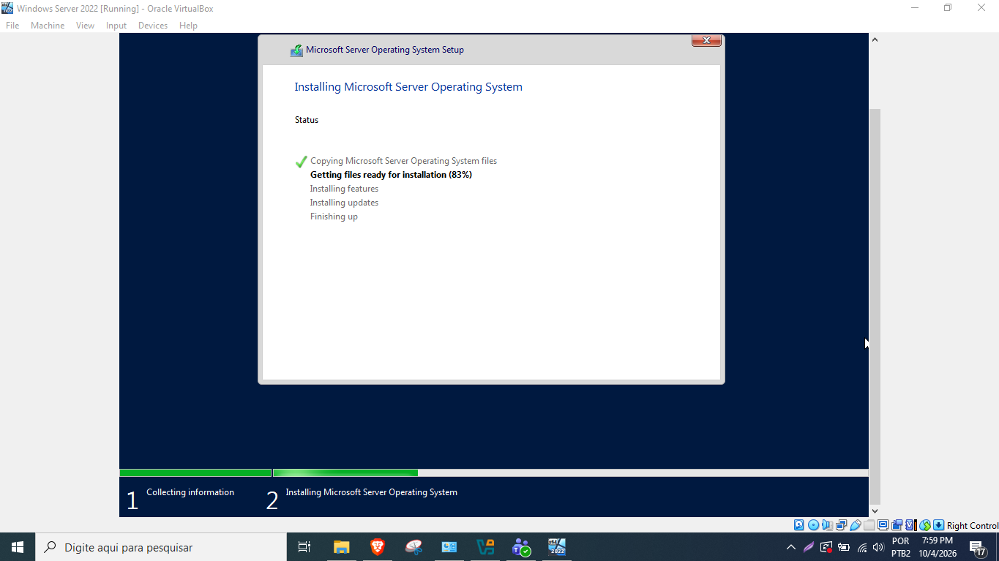

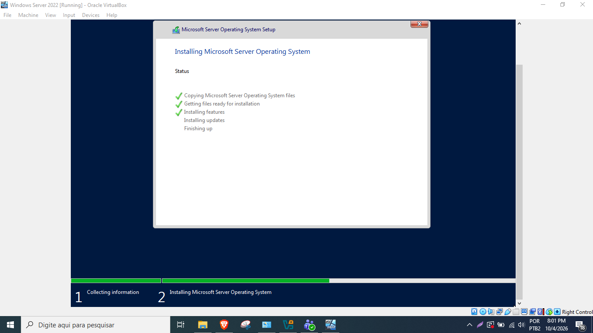

O sistema vai reiniciar sozinho algumas vezes.

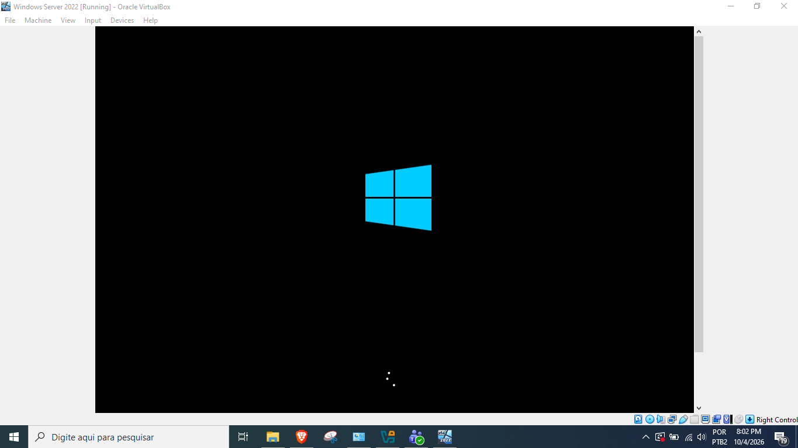

## Configurações Iniciais

Após a instalação, defina a senha para a conta de Administrador do sistema.

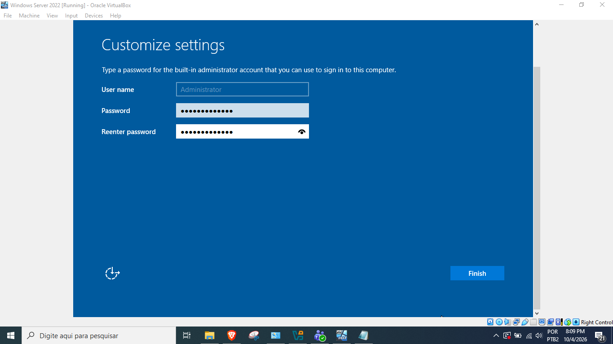

Para fazer o primeiro login, vá no menu superior do VirtualBox, clique em Entrada > Teclado > enviar Ctrl+Alt+Del, e digite a senha criada.

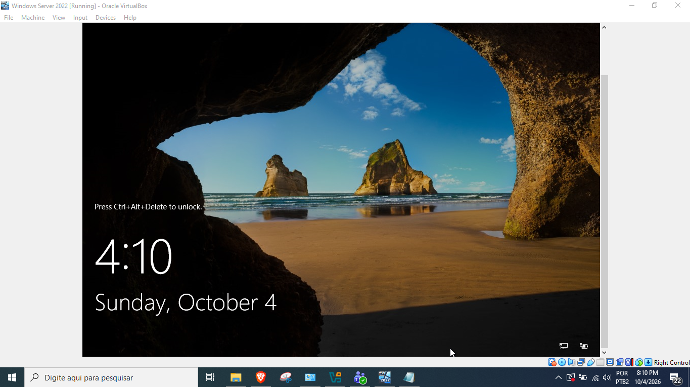

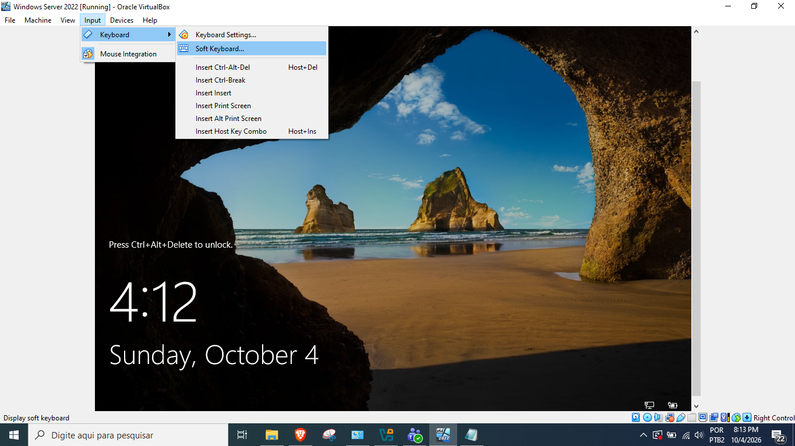

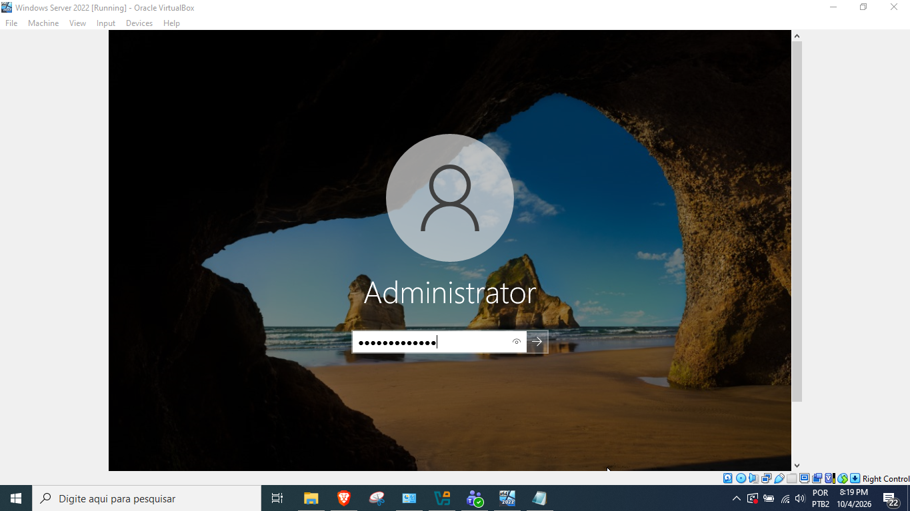

Assim que a área de trabalho carregar, crie um snapshot para segurança. Vá em Máquina, Snapshot, em seguida coloque o nome do snapshot e dê OK.

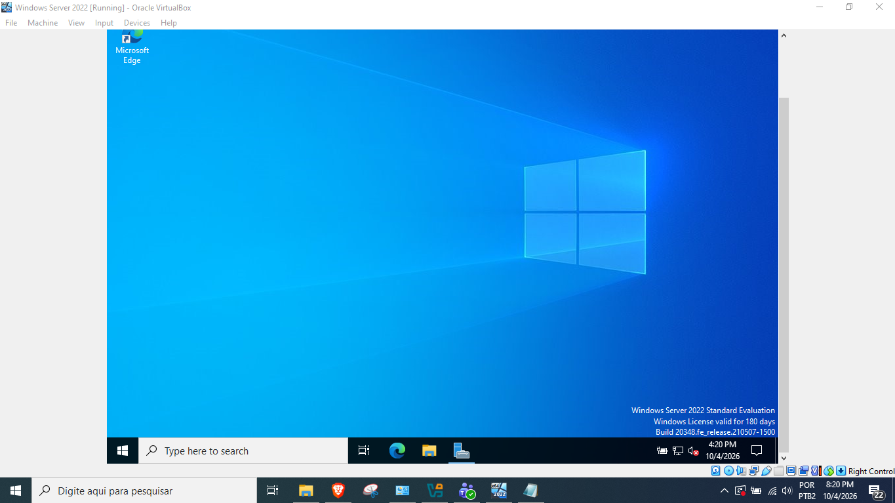

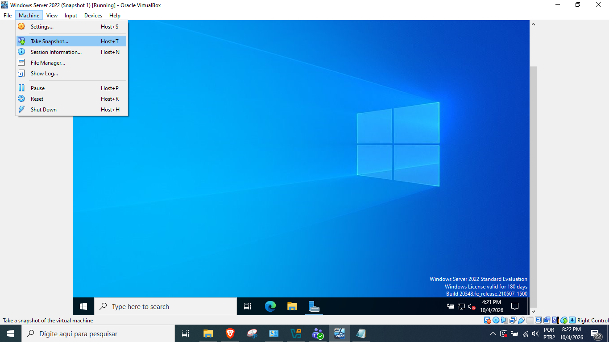

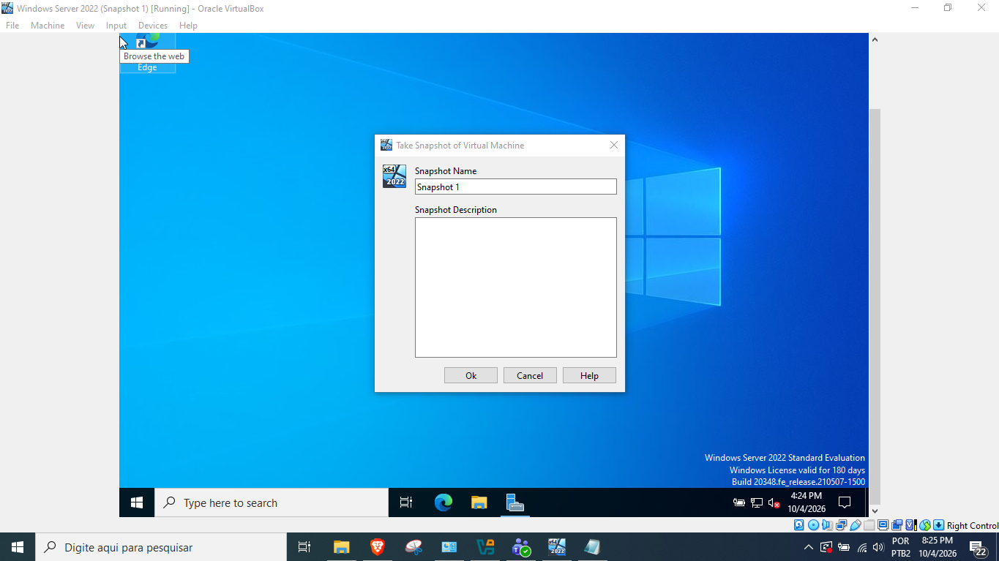

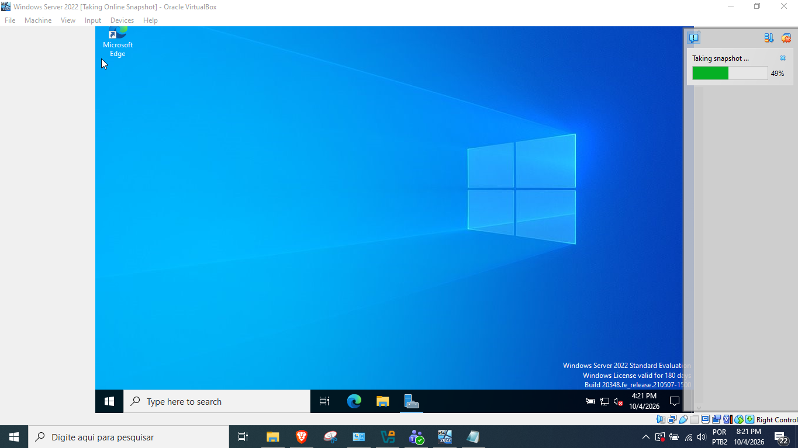

