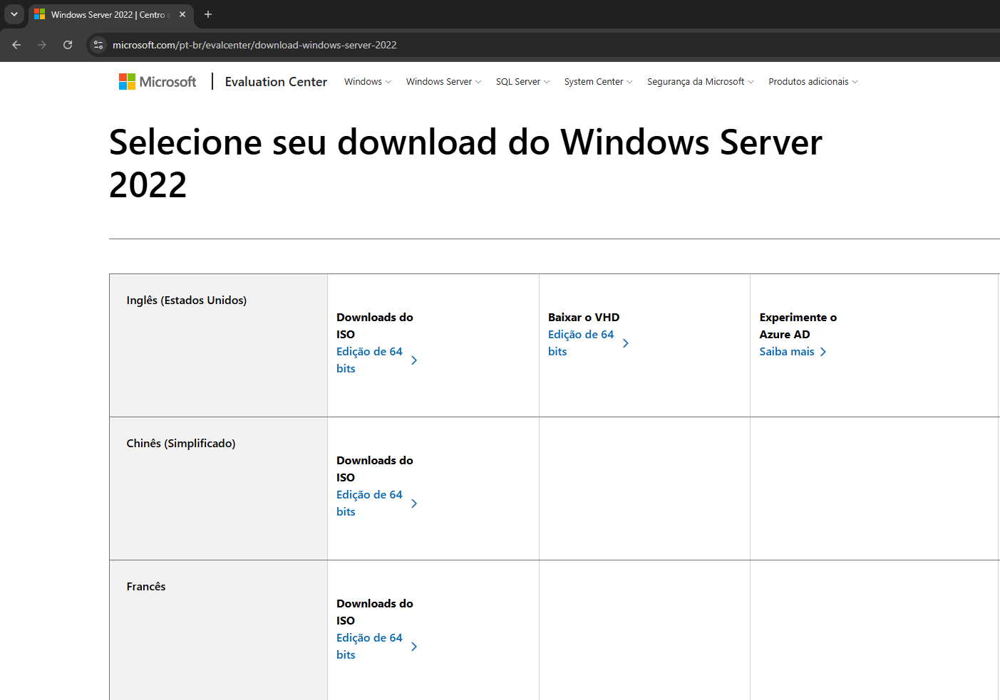
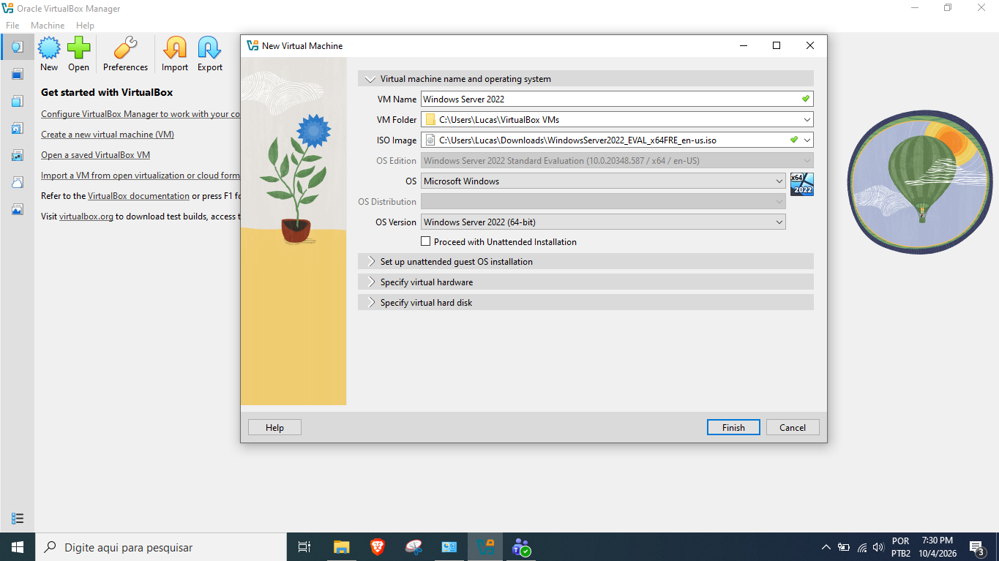

# Passo a Passo da Instalação do Windows Server 2022 no VirtualBox

## Início

Entre no site da Microsoft e procure pela ISO do windows Server 2022.

Tenha o VirtualBox instalado em seu computador.

## Criação da Máquina Virtual

Abra o VirtualBox e clique em Novo.
Defina um Nome (ex: Windows Server 2022).
Escolha o local onde o arquivo da máquina virtual será salvo (C:\Users\...\VirtualBox...)
Em Imagem ISO, selecione o arquivo baixado (procure a ISO do Windows Server 2022)
Escolha Tipo: Microsoft Windows e Versão: Windows 2022 (64-bit).

IMG: Passo 1 

IMG: Passo 2

IMG: Passo 3
Defina a Memória RAM (recomenda-se pelo menos 2 GB ou 4 GB) e o número de CPUs (2 núcleos).
IMG: Passo 3

IMG: Passo 4
Escolha Criar um novo disco rígido virtual e defina o tamanho (USEI UM DISCO DE 100 GB). Clique em finalizar.
IMG: Passo 4

## Instalação do Sistema

IMG: Passo 5
Clique em Iniciar para ligar a máquina virtual.
Pressione qualquer tecla quando aparecer a mensagem para dar o boot pela ISO.
IMG: Passo 5

IMG: Passo 6
Escolha o Idioma, o Formato de hora e o Teclado, e clique em Avançar.
IMG: Passo 6

IMG: Passo 7
Clique em Instalar agora.
IMG: Passo 7

IMG: Passo 8
Escolha a versão desejada: selecione Windows Server 2022 Standard (Experiência Desktop) caso queira a interface gráfica (tela normal com mouse).
IMG: Passo 8

IMG: Passo 9
Aceite os termos de licença e clique em Avançar.
IMG: Passo 9

IMG: Passo 10
Selecione Personalizada: instalar apenas o Windows (avançado).
IMG: Passo 10

IMG: Passo 11
• Escolha o disco virtual criado e clique em Avançar. A instalação dos arquivos vai começar.
IMG: Passo 11

IMG: Passo 12
• O sistema vai reiniciar sozinho algumas vezes.
IMG: Passo 13

## Configurações Iniciais

IMG: Passo 14
Após a instalação, defina a senha para a conta de Administrador do sistema.
IMG: Passo 14

 IMG: Passo 15
• Para fazer o primeiro login, vá no menu superior do VirtualBox, clique em Entrada > Teclado > enviar Ctrl+Alt+Del, e digite a senha criada.
IMG: Passo 16

IMG: Passo 18
Assim que a área de trabalho carregar, crie um snapshot para segurança. Vá em Máquina, Snapshot, em seguida coloque o nome do snapshot e dê OK.
