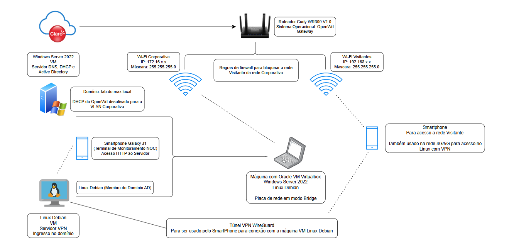

# Topologia LaboratorioDoMax (Em Desenvolvimento)

### Entrada de Internet e Roteamento

Conexão Claro -> Roteador Cudy WR300 V1.0 com OpenWrt.

### Segmentação e Segurança

Separação entre Wi-Fi Corporativa (172.16.x.x) e Wi-Fi Visitantes (192.168.x.x) com regras de firewall isolando as redes.
DHCP do roteador desativado na rede Wi-Fi Corporativa

### Virtualização Híbrida

Máquina hospedeira em modo Bridge rodando Windows Server 2022 (AD DS, DNS, DHCP) e Debian Linux (Servidor VPN WireGuard, membro do domínio lab.do.max.local).

### Cenário de Acesso Remoto

Smartphone acessando a rede corporativa a partir da rede 4G/5G usando VPN WireGuard.

