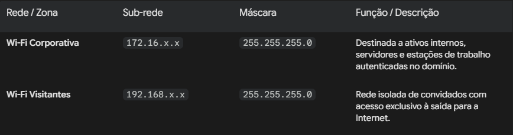

# Documentação de Arquitetura e Topologia de Rede
Este documento detalha o planejamento, a segmentação e os fluxos de comunicação do laboratório corporativo de borda segura.

## Diagrama da Topologia

### Visão Geral da Arquitetura
A arquitetura foi projetada para simular um ambiente corporativo moderno, priorizando a segmentação de rede, controle centralizado de identidades e acesso remoto seguro.

#### Borda & Roteamento (Gateway)
- Dispositivo: Roteador Cudy WR300 V1.0
- Sistema Operacional: OpenWrt
- Função Principal: Roteamento de borda, gerenciamento de VLANs/SSIDs e aplicação de políticas de Firewall.
- Conexão WAN: Interface conectada à rede da operadora (Claro) para acesso à Internet.

## 🌐Segmentação de Rede (VLANs & Wi-Fi)
A rede está dividida em duas zonas isoladas no nível de camada 2 e camada 3:

## 🛡️Políticas de Segurança & Firewall

- Isolamento Visitante: Regras estritas de Firewall configuradas no OpenWrt impedem que qualquer dispositivo na rede Visitantes (192.168.x.x) inicie tráfego para a rede Corporativa (172.16.x.x).
- DHCP Customizado: O serviço DHCP do OpenWrt é mantido desativado na interface Corporativa para permitir que o Active Directory gerencie a distribuição de IPs e opções de DNS.

## 🖥️Servidores e Serviços Core (Rede Corporativa)

### 1. Host de Virtualização

- Virtualizador: Oracle VM VirtualBox rodando no sistema host.
- Modo de Rede: Placas de rede virtuais em Modo Bridge, permitindo que as Máquinas Virtuais (VMs) obtenham endereçamentos diretos da sub-rede 172.16.x.x.

### 2. Controlador de Domínio (Windows Server 2022)

- Função: Active Directory Domain Services (AD DS), Servidor DNS e Servidor DHCP.
- Domínio: lab.do.max.local
- Escopo: Responsável por responder às requisições de nomes internos, autenticação corporativa e entrega de IP para a rede interna.

### 3. Servidor de Acesso Remoto (Linux Debian - VPN)

- Função: Servidor VPN WireGuard integrado ao Active Directory.
- Integração: Ingressado no domínio lab.do.max.local para validação de credenciais.

## 📱Terminais e Dispositivos Clientes

- Estação de Trabalho Linux: Máquina Virtual Debian 12 integrada como membro ativo do Active Directory.
- Terminal NOC / Monitoramento: Smartphone Samsung Galaxy J1 conectado via Wi-Fi Corporativa, utilizado como painel dedicado para monitoramento via HTTP dos serviços locais.
- Smartphone (Acesso Visitante & Remoto):
  - Quando conectado na rede local via Wi-Fi Visitantes, possui acesso apenas à Internet.
  - Quando fora do ambiente local (via 4G/5G), utiliza o cliente WireGuard para fechar um túnel criptografado com o Servidor VPN Debian, obtendo acesso seguro à rede Corporativa.

 
## 🔄Fluxo de Comunicação & VPN

1° Tráfego Interno (Corporativo): Dispositivos na sub-rede 172.16.x.x utilizam o Windows Server como DNS primário e o OpenWrt como Gateway padrão.

2° Tráfego Externo (VPN): O cliente mobile na rede externa (4G/5G) estabelece um túnel UDP com o IP de borda do OpenWrt, que redireciona o tráfego da porta VPN para o servidor Debian interno (descontando tratamentos de Duplo NAT, se necessário).

